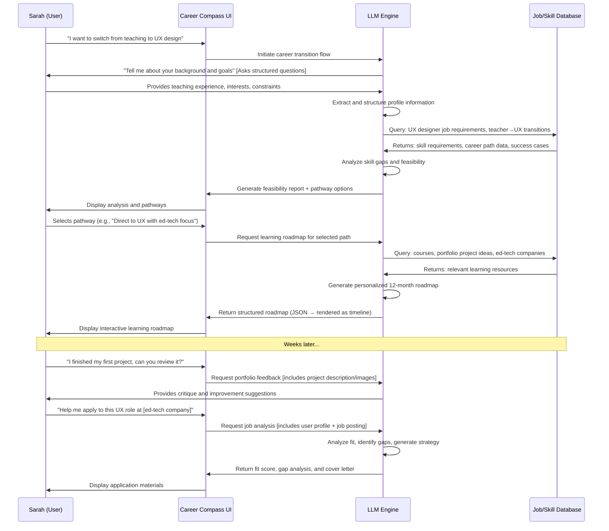
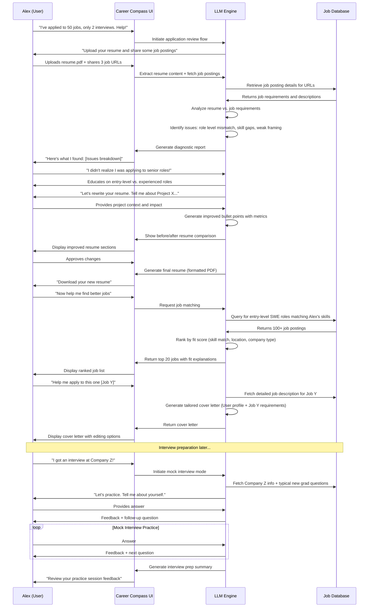

# Career Compass: LLM-Powered Career Advisory System

## Project Idea Pitch

Career Compass is an intelligent career advisory system that leverages LLMs to provide personalized guidance for career transitions, skill development, and job search strategies. Unlike generic career websites or standalone LLM chatbots, Career Compass integrates multi-source data synthesis (job market trends, skill databases, user career history) with structured conversational coaching to deliver actionable, context-aware recommendations. The system maintains persistent user profiles, tracks progress over time, and generates customized deliverables including learning roadmaps, resume revisions, tailored cover letters, and interview preparation plans. By combining the reasoning capabilities of LLMs with domain-specific career data and personalized user context, Career Compass bridges the gap between information overload and actionable career planning.

## Target Users

**Primary Users:**
- **Career Switchers**: Professionals looking to transition into new industries or roles (e.g., teacher → UX designer, engineer → product manager)
- **Recent Graduates**: College students and recent grads navigating their first job search or deciding on career paths
- **Skill Upgraders**: Mid-career professionals seeking to upskill or reskill to remain competitive or advance in their current field

**Secondary Users:**
- Career counselors and coaches seeking AI-assisted tools to support their clients
- Job seekers experiencing long-term unemployment needing structured guidance
- International professionals navigating new job markets

**User Characteristics:**
- Age range: 22-45 years old
- Comfortable with technology and conversational AI
- Motivated to actively engage in career development but overwhelmed by information
- Need personalized guidance beyond generic online resources

## Detailed Application Summary

### Core Functionality

**1. Career Profile Builder**
- Interactive onboarding conversation that builds a comprehensive user profile
- Captures: current role, skills, experience, education, interests, values, constraints (location, salary, time availability)
- Maintains and updates profile over time through ongoing interactions

**2. Career Path Explorer**
- Analyzes user profile against job market data to suggest potential career paths
- Identifies skill gaps for desired roles
- Provides realistic timelines and effort estimates for transitions
- Offers alternative pathways based on user constraints

**3. Skill Development Advisor**
- Generates personalized learning roadmaps with prioritized skills
- Recommends specific courses, projects, and resources
- Creates project ideas to build portfolio pieces
- Tracks learning progress and adjusts recommendations

**4. Job Application Assistant**
- Analyzes job descriptions and matches them to user profile
- Provides fit scores and identifies gaps
- Generates tailored cover letters
- Offers resume optimization suggestions for specific roles
- Creates application tracking and follow-up strategies

**5. Interview Preparation Coach**
- Conducts mock interviews tailored to specific roles/companies
- Provides feedback on responses
- Offers behavioral question practice with STAR method coaching
- Simulates technical/case interviews based on role type

**6. Career Strategy Consultant**
- Provides market insights and trend analysis
- Offers salary negotiation guidance
- Advises on personal branding and LinkedIn optimization
- Creates networking strategies

### User Interface
- Conversational chat interface as primary interaction mode
- Dashboard for viewing profile, progress, saved recommendations
- Document generation interface for resumes, cover letters, portfolios
- Progress tracking visualizations

### Technical Architecture
- Frontend: Web-based chat interface with document viewer
- Backend: LLM orchestration layer with prompt templates
- Data storage: User profiles, conversation history, generated documents
- External integrations: Job posting APIs, skill databases, learning platforms (optional)

## Data Requirements

### Input Data (Required for System Operation)

**1. User-Provided Data**
- **Structured Profile Data**: 
  - Professional: current/past job titles, companies, years of experience, skills (self-rated), education, certifications
  - Personal: career goals, interests, values, constraints (location preferences, salary requirements, work-life balance needs)
  - Format: Collected through structured forms and conversational extraction
  
- **Conversational Input**:
  - Open-ended responses about career history, aspirations, challenges
  - Uploaded documents: current resume (PDF/DOCX), portfolio links
  - Feedback on recommendations (thumbs up/down, ratings)

**2. External Data Sources**
- **Job Market Data**:
  - Job descriptions and postings (scraped or from APIs like LinkedIn, Indeed, Glassdoor)
  - Salary ranges by role/location
  - In-demand skills by industry/role
  - Company information and culture data
  
- **Skill & Learning Data**:
  - Skill taxonomies and relationships (e.g., O*NET database)
  - Course catalogs from platforms (Coursera, Udemy, LinkedIn Learning)
  - Skill requirement mappings for different roles
  - Industry certifications and their value

- **Career Path Data**:
  - Common transition pathways (e.g., teacher → instructional designer)
  - Career progression timelines
  - Success stories and case studies

**3. System-Generated Data**
- Conversation history and context
- Previous recommendations and user responses
- Tracked metrics (applications sent, interviews scheduled, skills learned)

### Output Data (Created by System)

**1. Persistent User Profile**
- Enriched profile with LLM-extracted insights from conversations
- Skill inventory with proficiency levels
- Career goals and preferences (structured from unstructured input)
- History of advice given and actions taken

**2. Generated Artifacts**
- Personalized learning roadmaps (structured JSON/markdown)
- Resume versions optimized for different roles
- Cover letters for specific applications
- Interview preparation materials
- Career transition plans with milestones

**3. Analytics Data**
- User engagement metrics
- Recommendation acceptance rates
- Success metrics (job offers, interviews, skill completions)

### Data Flow Example
```
User uploads resume → LLM extracts skills/experience → Stored in profile
User states "I want to become a data scientist" → LLM analyzes against job data → Identifies gaps → Generates learning plan
User requests cover letter → LLM combines (user profile + job description + company data) → Generates tailored letter
```

## Role of LLMs

### Core LLM Capabilities Utilized

**1. Natural Language Understanding & Extraction**
- Parse unstructured user input (conversations, resumes) to extract structured career information
- Understand nuanced career goals, constraints, and preferences
- Identify implicit skills and experiences from narrative descriptions
- Extract key requirements from job postings

**2. Reasoning & Analysis**
- Analyze skill gaps between current profile and target roles
- Evaluate career path feasibility based on user constraints
- Assess job posting fit and alignment with user goals
- Reason about skill relationships and learning dependencies
- Compare user qualifications against job requirements

**3. Personalized Content Generation**
- Create tailored learning roadmaps based on user profile and goals
- Generate role-specific cover letters incorporating user experience
- Write customized resume bullet points highlighting relevant achievements
- Produce interview preparation materials for specific companies/roles
- Create project ideas that bridge skill gaps

**4. Conversational Coaching**
- Conduct empathetic, multi-turn career counseling conversations
- Ask clarifying questions to understand user context
- Provide encouragement and manage expectations realistically
- Adapt communication style to user needs
- Remember context across sessions

**5. Synthesis & Recommendation**
- Synthesize information from multiple sources (user profile, job market, learning resources)
- Recommend optimal career paths given constraints
- Prioritize skills to learn based on ROI and user goals
- Suggest specific jobs, courses, and resources
- Provide strategic advice on timing and approach

**6. Simulation & Practice**
- Conduct realistic mock interviews with follow-up questions
- Provide constructive feedback on interview responses
- Simulate salary negotiations
- Role-play networking scenarios

### LLM Architecture in System

**Prompt Engineering Strategy:**
- **System prompts** define Career Compass persona and guidelines
- **Template prompts** for specific tasks (resume analysis, skill gap identification)
- **Context injection** with user profile, relevant data, and conversation history
- **Output formatting** instructions for structured data generation (JSON, markdown)

**Multi-Agent or Multi-Step Workflows:**
- Profile Builder Agent → extracts and structures user information
- Career Analyst Agent → performs gap analysis and feasibility assessment
- Content Generator Agent → creates documents and learning plans
- Coach Agent → handles conversational interactions and feedback

**RAG (Retrieval-Augmented Generation):**
- Retrieve relevant job postings based on user goals
- Fetch skill requirements for target roles
- Pull course recommendations from learning databases
- Access company information for tailored applications

## Differentiation from Existing Solutions

### vs. Non-LLM Career Platforms (LinkedIn, Indeed, CareerBuilder)

**Limitations of Traditional Platforms:**
- Passive job listing aggregation without personalization
- No conversational guidance or coaching
- Skills are self-reported without validation or context
- Generic resume templates without role-specific optimization
- No reasoning about career transitions or skill gaps
- Limited synthesis across multiple data sources

**Career Compass Advantages:**
- **Active Guidance**: Proactively suggests paths rather than waiting for user queries
- **Personalized Synthesis**: Combines user history, goals, and market data to create unique recommendations
- **Conversational Interface**: Natural language interaction vs. form-filling
- **Context-Aware Generation**: Creates documents that incorporate user's specific experiences and target role requirements
- **Reasoning Engine**: Understands "why" and "how" of career transitions, not just "what" jobs exist
- **Adaptive Learning**: Refines recommendations based on ongoing conversations and feedback

### vs. General Purpose LLMs (ChatGPT, Claude, Gemini)

**Limitations of Generic LLMs:**
- No persistent user profile or memory across sessions
- No access to real-time job market data
- No structured workflows for career development
- Lack of domain-specific optimization and prompting
- No progress tracking or accountability
- Users must drive conversation; no proactive guidance
- Responses may be generic without personalized context

**Career Compass Advantages:**
- **Persistent Memory**: Maintains detailed user profile and conversation history
- **Data Integration**: Connects to job market data, skill databases, learning platforms
- **Structured Workflows**: Guides users through proven career development processes
- **Domain Optimization**: Prompts and agent behaviors specifically designed for career advising
- **Progress Tracking**: Monitors user actions and adjusts recommendations over time
- **Proactive Nudges**: Follows up on recommendations and reminds users of next steps
- **Specialized Evaluation**: Built-in validation of career advice quality and feasibility
- **Curated Resources**: Pre-vetted learning materials and job opportunities
- **Role-Specific Expertise**: Deep knowledge of particular industries, roles, and transitions

### vs. Human Career Counselors

**Not a Replacement But a Complement:**
- **Scale**: Available 24/7 without scheduling constraints
- **Cost**: Much more affordable than hourly coaching
- **Data Processing**: Can analyze hundreds of job postings and courses instantly
- **Consistency**: Always patient, non-judgmental, and thorough
- **Limitations**: Cannot provide emotional support at human level or navigate highly complex/unique situations

**Ideal Use Case**: First-line guidance and structured planning, with human counselors for complex cases

---

## Usage Scenarios

*Each team member should create two usage scenarios following the template below. Here are two example scenarios to get started:*

---

### Usage Scenario 1: Career Switcher - Teacher to UX Designer

#### Short Description
A high school teacher with 5 years of experience wants to transition into UX design but doesn't know where to start or if it's realistic given their background.

#### Narrative
Sarah, a 30-year-old high school English teacher, has become interested in UX design after taking an online course for fun. She feels unfulfilled in teaching and wants to make a career change but is overwhelmed by the transition. She has strong communication and empathy skills but no formal design or technical background. She's worried about salary changes, timeline, and whether her teaching experience is valuable in UX.

Sarah starts by having a conversation with Career Compass, which asks about her background, what drew her to UX, her constraints (needs to maintain income, can dedicate 10-15 hours/week to learning), and her concerns. The system analyzes her profile against UX job requirements and identifies:
- **Transferable skills**: User research, communication, empathy, presentation, feedback iteration
- **Skill gaps**: Visual design, prototyping tools (Figma), user testing, information architecture, front-end basics
- **Pathway**: Junior UX Designer roles at ed-tech companies (leverage teaching domain expertise)

Career Compass generates a 12-month learning roadmap with specific courses, portfolio projects (redesign teaching tools she's used), and networking strategies. It suggests transitioning via instructional design as a stepping stone. As Sarah progresses, she uploads her portfolio projects for feedback and practices UX interview questions specific to ed-tech companies.

#### Step-by-Step Interaction

**Step 1: Onboarding & Profile Building**
- System: "Hi! I'm Career Compass. I'm here to help you navigate your career journey. Tell me about yourself—what do you currently do?"
- User: "I'm a high school English teacher, been doing it for 5 years."
- System: [Extracts: current role, years of experience] "What's making you explore new career options?"
- User: "I took a UX design course and really enjoyed it. I feel like I'd be good at understanding what users need."
- System: [Identifies: career interest = UX design, motivation = enjoys user-centric thinking]
- System asks follow-up questions about: salary needs, time availability, location preferences, specific UX interests

**Step 2: Career Path Analysis**
- System analyzes teacher→UX designer transitions in database
- Retrieves job postings for "Junior UX Designer" and "UX Researcher" roles
- Identifies skill gaps and overlap
- Generates feasibility report

**Step 3: Presentation of Findings**
- System: "Great news! Your teaching background is actually valuable for UX. Here's what I found..."
- Shows visual breakdown: transferable skills (40% match), skill gaps, recommended timeline (12-18 months)
- Presents 3 pathway options: 1) Direct to UX, 2) Via instructional design, 3) UX research focus
- User selects pathway

**Step 4: Learning Roadmap Generation**
- System creates personalized roadmap with phases:
  - Month 1-3: Fundamentals (Figma, design thinking)
  - Month 4-6: First portfolio project (redesign school platform)
  - Month 7-9: Advanced skills (user testing, prototyping)
  - Month 10-12: Job prep (portfolio site, interview practice)
- Includes specific course recommendations with estimated time/cost

**Step 5: Ongoing Support**
- User returns weekly to report progress
- Uploads portfolio projects for feedback
- Requests cover letter for ed-tech UX role
- Practices mock interviews
- System adjusts timeline based on actual progress



#### Data Description

**Input Data Needed:**

1. **User Profile Data** (collected via conversation and forms):
   - Current role: "High School English Teacher"
   - Years of experience: 5
   - Skills: Teaching, curriculum design, communication, public speaking, feedback, empathy
   - Education: Bachelor's in English, Master's in Education
   - Constraints: Current salary $55k, needs $50k+ in new role, can dedicate 10-15 hrs/week, prefers remote
   - Goals: "Transition to UX design, work in ed-tech"
   - Timeline flexibility: 12-18 months acceptable

2. **Job Market Data** (retrieved from database/APIs):
   - Job postings for "Junior UX Designer" (100+ recent postings)
   - Required skills: Figma, user research, wireframing, prototyping, basic HTML/CSS, portfolio
   - Salary ranges: $60-85k for junior roles
   - Ed-tech company list and culture info

3. **Career Path Data**:
   - Historical transition data: teacher → UX designer (success rate, timeline, common pathways)
   - Skill mapping: teaching skills → UX equivalents
   - Stepping stone roles: instructional designer, UX researcher

4. **Learning Resources**:
   - Course catalog: UX design courses with reviews, time estimates, costs
   - Portfolio project ideas relevant to education domain
   - Communities and networking groups

**Output Data Created:**

1. **Enriched User Profile** (stored in database):
```json
{
  "user_id": "sarah_123",
  "current_role": "High School English Teacher",
  "experience_years": 5,
  "target_role": "UX Designer",
  "transferable_skills": [
    {"skill": "User Research", "source": "Teaching/Student feedback", "confidence": "high"},
    {"skill": "Communication", "source": "Teaching", "confidence": "high"},
    {"skill": "Empathy", "source": "Student interaction", "confidence": "high"}
  ],
  "skill_gaps": [
    {"skill": "Figma", "priority": "high", "learn_time_weeks": 4},
    {"skill": "Prototyping", "priority": "high", "learn_time_weeks": 8},
    {"skill": "Information Architecture", "priority": "medium", "learn_time_weeks": 6}
  ],
  "constraints": {
    "min_salary": 50000,
    "study_hours_per_week": 12,
    "preferred_location": "remote",
    "timeline_months": 12
  },
  "recommended_pathway": "direct_to_ux_with_edtech_focus"
}
```

2. **Learning Roadmap** (markdown/JSON):
```markdown
# UX Designer Learning Roadmap for Sarah

## Phase 1: Foundations (Months 1-3)
- Course: "Google UX Design Professional Certificate" (20 hrs/week, 3 months) - $49/month
- Practice: Figma tutorials (2 hrs/week)
- Reading: "Don't Make Me Think" by Steve Krug
- Goal: Complete first wireframe exercise

## Phase 2: First Portfolio Project (Months 4-6)
- Project: Redesign Google Classroom interface based on teacher insights
- Skills practiced: User research, wireframing, prototyping, usability testing
- Deliverable: Case study with problem statement, process, solution

[... continues through Month 12]
```

3. **Generated Application Materials**:
   - Cover letter for specific ed-tech company (Word doc)
   - Resume with UX-optimized bullet points highlighting teaching experience
   - LinkedIn summary rewrite for UX positioning

4. **Conversation History & Context**:
   - All chat interactions stored for context in future sessions
   - User feedback on recommendations (liked/disliked)
   - Progress updates (completed courses, finished projects)

#### Evaluation

**Success Criteria:**

1. **Profile Completeness** (Automated Check):
   - System captures all key profile fields: current role, skills, goals, constraints ✓
   - User explicitly confirms profile accuracy ✓

2. **Pathway Feasibility** (Manual Review):
   - Recommended timeline is realistic (12-18 months for teacher→UX is reasonable) ✓
   - Skill gap identification is accurate (should include Figma, prototyping, etc.) ✓
   - Salary expectations are market-aligned ($60-85k for junior UX is accurate) ✓

3. **Roadmap Quality** (Expert Review):
   - Learning resources are appropriate for beginner level ✓
   - Portfolio projects leverage teaching background ✓
   - Sequencing makes pedagogical sense (foundations → practice → polish) ✓
   - Time estimates are reasonable given user's 10-15 hrs/week constraint ✓

4. **User Satisfaction** (Survey):
   - User feels the advice is personalized (not generic) ✓
   - User reports feeling less overwhelmed and more confident ✓
   - User intends to follow the roadmap ✓

5. **Content Quality** (Automated + Manual):
   - Cover letters are tailored (mention teaching experience in ed-tech context) ✓
   - No hallucinated companies, courses, or salary data ✓
   - Grammar and formatting are professional ✓

**Testing Approach:**

1. **Unit Tests**:
   - Profile extraction: Given conversation transcript, verify all fields extracted correctly
   - Skill mapping: Verify "teaching" correctly maps to "communication," "empathy," "feedback," etc.
   - Job matching: Given user profile, verify appropriate UX roles retrieved

2. **Integration Tests**:
   - End-to-end scenario: Simulate full conversation, verify roadmap generated
   - Multi-session continuity: Verify system remembers context across sessions

3. **Evaluation with Test Users**:
   - Recruit 5-10 career switchers (not necessarily teachers)
   - Have them complete onboarding and receive roadmap
   - Survey: usefulness (1-5), personalization (1-5), likelihood to follow advice (1-5)
   - Compare Career Compass roadmap vs. generic ChatGPT advice

4. **Adversarial Testing**:
   - Ambiguous input: "I hate my job and want to do something creative" → system should ask clarifying questions
   - Unrealistic goals: "I want to be a senior UX designer in 3 months" → system should manage expectations
   - Missing data: User refuses to share salary needs → system should work with available info or explain limitations
   - Contradictory input: "I want high salary but only part-time work" → system should acknowledge trade-offs

**Potential Complications:**

1. **Unrealistic User Expectations**:
   - Mitigation: LLM should provide realistic timelines and manage expectations upfront
   - Example: "Most teacher-to-UX transitions take 12-18 months of consistent effort"

2. **Inaccurate Skill Self-Assessment**:
   - User overestimates or underestimates their skills
   - Mitigation: Ask for concrete examples, portfolio evidence; suggest self-assessment exercises

3. **Outdated Job Market Data**:
   - If system uses cached job data, advice may be stale
   - Mitigation: Regular data refreshes, date stamps on advice, disclaimer about market changes

4. **User Disengagement**:
   - User creates roadmap but doesn't return
   - Mitigation: Proactive check-ins, progress tracking, optional email reminders

5. **Over-reliance on LLM**:
   - User expects system to guarantee job success
   - Mitigation: Clear disclaimers, emphasize user agency, suggest human coaching for complex cases

6. **Privacy Concerns**:
   - User worried about sharing career history and resume
   - Mitigation: Clear privacy policy, optional data deletion, on-device processing for sensitive docs

---

### Usage Scenario 2: Recent Graduate - First Job Search

#### Short Description
A recent computer science graduate is applying to software engineering jobs but getting no responses. They need help understanding why and improving their application materials.

#### Narrative
Alex just graduated with a CS degree and has applied to 50 software engineering jobs over 2 months but received only 2 interviews and no offers. They're frustrated and don't know what's wrong—whether it's their resume, cover letters, or the roles they're targeting. Alex has personal projects but hasn't framed them well. They're applying to everything from startups to FAANG companies without a clear strategy.

Alex uploads their resume and shares examples of jobs they've applied to. Career Compass analyzes the resume and identifies issues:
- Generic objective statement
- Project descriptions lack impact metrics
- Skills listed don't match job requirements
- No clear narrative connecting education to desired roles

The system also analyzes Alex's application strategy: they're applying to senior roles and jobs requiring 3-5 years of experience. Career Compass educates Alex on entry-level vs. mid-level requirements and helps them identify appropriate roles. It then generates:
1. Resume rewrite with stronger bullet points
2. Sample cover letter framework
3. List of 20 well-matched entry-level roles
4. Interview prep for common new grad questions

Over subsequent sessions, Alex practices behavioral interviews, gets feedback on take-home coding assignments, and learns salary negotiation basics.

#### Step-by-Step Interaction

**Step 1: Problem Identification**
- User: "I've applied to 50 jobs and only got 2 interviews. I don't know what I'm doing wrong."
- System: "Let's figure this out together. Can you upload your resume and share a few job postings you've applied to?"
- User uploads resume (PDF) and shares 3 job URLs
- System analyzes both resume and job requirements

**Step 2: Resume Analysis**
- LLM extracts resume content: education, skills, projects, experience
- Compares against job requirements from postings
- Identifies mismatches:
  - Applying to "3-5 years experience" when Alex has 0
  - Skills on resume (Java, Python) don't match job emphasis (React, Node.js)
  - Project descriptions are technical jargon without business impact
  - No quantifiable achievements
- Generates diagnostic report

**Step 3: Presenting Findings**
- System: "I found several issues. First, many jobs you're applying to require 3-5 years of professional experience..."
- Displays visual breakdown: role level mismatch, skill gaps, resume weaknesses
- User: "Oh no, I thought I could apply to any SWE role"
- System educates on entry-level vs. experienced roles

**Step 4: Resume Optimization**
- System: "Let's rewrite your resume. I'll focus on your strongest projects. Tell me more about [Project X]—what problem did it solve? What was the impact?"
- User provides context
- LLM generates improved bullet points with STAR format
- Shows before/after comparison
- User approves changes
- System generates updated resume (PDF download)

**Step 5: Job Matching & Strategy**
- System: "Now let's find better-fit roles. Based on your skills, here are 20 entry-level positions..."
- Retrieves and ranks recent postings
- For each job, provides fit score and reasoning
- User: "These look much more realistic. Can you help me apply to this one?"
- System generates tailored cover letter for selected job

**Step 6: Interview Preparation**
- User: "I have an interview next week!"
- System: "Great! Let's prepare. This is for [Company X], a startup. Common new grad questions include..."
- Conducts mock interview with role-specific questions
- Provides feedback on answers
- User practices multiple times



#### Data Description

**Input Data Needed:**

1. **User-Provided Data**:
   - Resume (PDF/DOCX) - uploaded file
   - Job postings applied to (URLs or text) - 3-5 examples
   - Conversational context: "I've applied to 50 jobs, got 2 interviews"
   - Degree: "Computer Science, May 2024"
   - Projects: descriptions of 2-3 class/personal projects
   - Preferences: company type, location, work style

2. **Resume Parsing** (extracted by LLM):
   - Education: degree, school, graduation date, GPA
   - Skills: programming languages, frameworks, tools
   - Projects: names, descriptions, technologies
   - Experience: internships, part-time jobs (if any)
   - Achievements: awards, leadership, publications

3. **Job Market Data** (external sources):
   - Job posting details for provided URLs:
     - Title, company, location, salary range
     - Required qualifications, years of experience
     - Skills and technologies mentioned
     - Job level (entry, mid, senior)
   - Database of entry-level SWE jobs:
     - New grad roles, junior positions
     - Company types: startups, mid-size, large tech
     - Application counts, response rates

4. **Interview Preparation Data**:
   - Common new grad interview questions by company type
   - Company-specific information (culture, recent news, products)
   - Behavioral question frameworks (STAR method)
   - Coding interview patterns (if applicable)

**Output Data Created:**

1. **Diagnostic Report** (JSON + formatted display):
```json
{
  "analysis_date": "2024-11-09",
  "resume_issues": [
    {
      "issue": "Applying to roles requiring 3-5 years experience",
      "severity": "high",
      "evidence": "3 of 3 sample jobs require 'Senior' or '3+ years'",
      "recommendation": "Focus on 'New Grad', 'Junior', 'Entry-Level' positions"
    },
    {
      "issue": "Project descriptions lack quantifiable impact",
      "severity": "medium",
      "example": "Built a web app using React and Node.js",
      "improvement": "Built a task management web app using React and Node.js, improving team productivity by 30% (5 users)"
    },
    {
      "issue": "Skills mismatch",
      "severity": "medium",
      "details": "Resume emphasizes Java/Python; sample jobs want React/TypeScript"
    }
  ],
  "skill_gaps": [
    {"skill": "React", "mentioned_in_jobs": 3, "on_resume": false},
    {"skill": "TypeScript", "mentioned_in_jobs": 2, "on_resume": false}
  ],
  "job_matching_score": 35,
  "recommendations": [
    "Rewrite resume to emphasize projects with impact metrics",
    "Target entry-level roles explicitly",
    "Build a small React project to add to portfolio",
    "Apply to 10-15 well-matched jobs instead of scattershot approach"
  ]
}
```

2. **Improved Resume** (formatted Word doc):
   - Rewritten project bullet points:
     - Before: "Built a web app using React and Node.js"
     - After: "Developed a collaborative task management web app using React and Node.js, supporting 5 concurrent users with real-time updates via WebSockets"
   - Added metrics where possible: "Optimized database queries, reducing load time by 40%"
   - Reorganized skills section to prioritize in-demand technologies
   - Removed generic objective, replaced with targeted summary

3. **Matched Job List** (structured data):
```json
{
  "recommended_jobs": [
    {
      "title": "New Grad Software Engineer",
      "company": "Startup X",
      "location": "Remote",
      "fit_score": 85,
      "reasoning": "Explicitly targets new grads, requires React/Node which matches your projects, startup environment aligns with your interest in fast-paced work",
      "application_url": "https://...",
      "salary_range": "$90-110k"
    },
    // ... 19 more jobs
  ]
}
```

4. **Tailored Cover Letter** (Word doc):
```
Dear Hiring Manager,

I'm excited to apply for the New Grad Software Engineer position at Startup X. As a recent Computer Science graduate from [University], I've developed strong full-stack skills through both coursework and personal projects that align closely with your needs.

In my senior capstone project, I built [Project X], a web application using React and Node.js that [specific achievement related to job requirements]. This experience taught me [skills mentioned in job posting]. I'm particularly drawn to Startup X's mission to [company-specific detail] because [personal connection].

I'd welcome the opportunity to discuss how my background in [relevant skills] could contribute to your team.

Best regards,
Alex
```

5. **Interview Prep Materials** (markdown document):
```markdown
# Interview Prep for Company Z - Entry-Level SWE

## Company Overview
- Founded: 2018
- Product: [description]
- Culture: [key values]
- Recent news: [funding round, product launch]

## Common New Grad Questions
1. "Tell me about yourself"
   - Your answer: [draft provided by user]
   - Feedback: Strong opening, but consider adding more about why this role specifically...

2. "Why Company Z?"
   - Research notes: Company focuses on [X], values [Y]
   - Suggested angle: Connect your project experience to their product

## Mock Interview Transcript
Q: "Tell me about a time you debugged a difficult problem."
A: [User's answer]
Feedback: Good use of STAR method. Consider adding the time pressure element...

[... continues with 5-10 practice questions and feedback]
```

6. **Updated User Profile**:
```json
{
  "user_id": "alex_456",
  "education": {"degree": "BS Computer Science", "school": "State University", "grad_date": "2024-05"},
  "experience_level": "new_grad",
  "skills": {
    "proficient": ["Python", "Java", "React", "Node.js", "SQL"],
    "familiar": ["Docker", "AWS", "Git"]
  },
  "projects": [
    {
      "name": "Task Management App",
      "technologies": ["React", "Node.js", "MongoDB", "WebSockets"],
      "impact": "Supported 5 users, real-time collaboration",
      "github": "https://github.com/alex/taskapp"
    }
  ],
  "application_history": {
    "total_applications": 50,
    "interviews": 2,
    "issues_identified": ["role_level_mismatch", "weak_resume", "scatter_shot_strategy"]
  },
  "target_roles": ["New Grad SWE", "Junior Software Engineer", "Entry-Level Full-Stack"],
  "preferences": {
    "company_type": ["startup", "mid-size tech"],
    "work_style": "remote or hybrid",
    "min_salary": 85000
  }
}
```

#### Evaluation

**Success Criteria:**

1. **Accurate Diagnosis** (Automated + Expert Review):
   - System correctly identifies resume issues (weak bullet points, skill gaps) ✓
   - Recognizes role level mismatch (applying to senior roles as new grad) ✓
   - Provides actionable, specific recommendations (not generic advice) ✓
   - Verification: Compare LLM diagnosis against expert career counselor review

2. **Resume Quality Improvement** (A/B Test):
   - Rewritten resume gets more positive feedback from recruiters
   - Before/After comparison: improved metrics inclusion, clearer impact statements ✓
   - Test: Send both versions to mock recruiters, measure which gets higher scores

3. **Job Matching Accuracy** (Manual Validation):
   - Recommended jobs are genuinely entry-level (not mislabeled) ✓
   - Fit scores correlate with human judgment ✓
   - Skill requirements align with user's background ✓
   - Test: Expert rates each recommended job on appropriateness (1-5 scale)

4. **Cover Letter Quality** (Rubric Evaluation):
   - Tailored to specific job (mentions company/role details) ✓
   - Incorporates user's projects/experience ✓
   - Professional tone and error-free ✓
   - Test: Rubric with criteria: personalization (1-5), professionalism (1-5), relevance (1-5)

5. **Interview Prep Effectiveness** (User Feedback):
   - User reports feeling more confident after mock interview ✓
   - Feedback on answers is constructive and specific ✓
   - Practice questions are relevant to role/company type ✓
   - Test: Post-interview survey asking if prep helped (yes/no/somewhat)

6. **Outcome Metrics** (Long-term tracking):
   - User application success rate improves (e.g., from 4% interview rate to 15%) ✓
   - User gets job offer within 3 months of using system ✓
   - User reports Career Compass was "very helpful" or "essential" to success ✓

**Testing Approach:**

1. **Automated Testing**:
   - **Resume parsing**: Given 10 diverse resumes, verify all key fields extracted correctly
   - **Issue detection**: Create resumes with known flaws (no metrics, generic language), verify system flags them
   - **Job matching**: Given user profile, verify returned jobs are actually entry-level (check title, requirements)

2. **Comparative Evaluation**:
   - **vs. Generic LLM**: Give ChatGPT the same resume and job postings, compare quality of feedback
   - Metrics: specificity of recommendations, actionability, accuracy of job matches
   - **vs. Human Expert**: Have career counselor review same resume, compare diagnoses
   
3. **User Studies** (N=10-15 recent grads):
   - Participants use Career Compass for full job search (2-4 weeks)
   - Track: applications sent, interviews received, job offers
   - Compare to control group using traditional job search methods
   - Collect qualitative feedback: most useful features, pain points

4. **Component Testing**:
   - **Resume rewriting**: Show before/after to recruiters, measure preference
   - **Cover letters**: Rate on personalization, relevance, writing quality
   - **Mock interviews**: User self-reports confidence before/after

5. **Adversarial Testing**:
   - **Ambiguous resume**: Sparse information, unclear projects → system should ask clarifying questions
   - **Overqualified user**: PhD applying to junior roles → system should flag mismatch differently
   - **Unrealistic expectations**: "I want $200k as a new grad" → system should educate on market rates
   - **Poor interview answers**: User gives rambling, off-topic responses → system should provide constructive feedback without being harsh
   - **Mismatched goals**: "I want work-life balance at a startup" → system should acknowledge trade-offs

**Potential Complications & Mitigations:**

1. **Resume Parsing Errors**:
   - Problem: LLM misinterprets unusual resume formats or extracts wrong data
   - Mitigation: Fallback to structured form if confidence is low; show extracted profile to user for confirmation
   - Test case: Submit poorly formatted resume, verify graceful handling

2. **Outdated Job Postings**:
   - Problem: Retrieved job has already been filled or removed
   - Mitigation: Date stamp on jobs, prioritize recent postings, allow user to report dead links
   - Test case: Include expired job in database, verify system doesn't strongly recommend it

3. **Overconfidence in Advice**:
   - Problem: LLM gives overly definitive advice ("You will definitely get this job")
   - Mitigation: Prompt engineering to use probabilistic language ("likely," "typically"), disclaimers
   - Test case: Review generated content for inappropriate certainty claims

4. **User Discouragement**:
   - Problem: Harsh feedback on resume could demotivate user
   - Mitigation: Frame criticism constructively, emphasize improvements, celebrate strengths
   - Test case: Submit weak resume, verify tone is encouraging

5. **Hallucinated Job Details**:
   - Problem: LLM invents company information or salary ranges
   - Mitigation: Always ground advice in retrieved data, show sources, allow fact-checking
   - Test case: Request info for obscure company, verify LLM says "I don't have info" rather than inventing

6. **Biased Recommendations**:
   - Problem: System inadvertently biases toward certain company types or roles
   - Mitigation: Diverse training data, explicit criteria for recommendations, bias audits
   - Test case: Same profile but different demographics, verify similar job recommendations

7. **Privacy Concerns**:
   - Problem: User worried about uploading resume with personal info
   - Mitigation: Clear data retention policy, option to redact PII, local processing options
   - Test case: Upload resume with sensitive info (address, SSN), verify appropriate handling

---

## Team Member Templates for Additional Scenarios

*Each team member should create two usage scenarios using the template below:*

### Usage Scenario Template

#### Short Description
[1-2 sentences describing the user and their goal]

#### Narrative
[2-3 paragraphs telling the story of how the user engages with Career Compass, what problem they're trying to solve, and how the system helps them]

#### Step-by-Step Interaction
[Detailed breakdown of the conversation/interaction flow. Can use bullet points and/or a Mermaid sequence diagram]

#### Data Description

**Input Data Needed:**
[List all data required for this scenario:
- User-provided data (profile info, uploads, conversations)
- External data sources (job postings, market data, learning resources)
- System context (conversation history, previous recommendations)]

**Output Data Created:**
[List all data generated during this scenario:
- Updated user profile/state
- Generated artifacts (resumes, roadmaps, letters)
- Conversation logs and context]

[Include JSON examples or other structured data formats where relevant]

#### Evaluation

**Success Criteria:**
[Define 4-6 specific, measurable criteria for success in this scenario]

**Testing Approach:**
[Describe how you will test/validate this scenario:
- Automated tests
- User studies
- Comparative evaluation
- Expert review]

**Potential Complications:**
[List 3-5 edge cases, errors, or challenges that could arise and how the system should handle them]

---

## Additional Scenario Ideas (For Team Members)

Here are some ideas for additional usage scenarios you could develop:

1. **Skill Development for Current Role**: User wants to advance in current career, needs to identify high-ROI skills to learn
2. **Salary Negotiation Coach**: User received job offer, needs help negotiating compensation package
3. **LinkedIn Profile Optimization**: User wants to improve visibility to recruiters, needs profile rewrite
4. **Career Pivot After Industry Disruption**: User's industry is declining (e.g., journalism, retail), needs to identify transferable skills
5. **Re-entering Workforce**: User took 5-year career break (parenting, illness), needs to update skills and explain gap
6. **Portfolio Building**: User needs to create compelling portfolio pieces to demonstrate skills
7. **Networking Strategy**: User is introverted, needs structured approach to professional networking
8. **Job Offer Comparison**: User has multiple offers, needs decision framework
9. **Freelance to Full-Time**: User has been freelancing, wants to transition to traditional employment
10. **International Job Search**: User wants to work in a different country, needs to understand visa, credential recognition

---

## Project Repository Structure

```
career-compass/
├── README.md
├── project_outline.md (this document)
├── notebooks/
│   ├── 01_profile_builder_prototype.ipynb
│   ├── 02_skill_gap_analyzer.ipynb
│   ├── 03_learning_roadmap_generator.ipynb
│   ├── 04_resume_optimizer.ipynb
│   ├── 05_interview_coach.ipynb
├── data/
│   ├── sample_profiles/
│   ├── job_postings/
│   ├── skill_taxonomy/
│   └── learning_resources/
├── prompts/
│   ├── profile_extraction.txt
│   ├── career_analysis.txt
│   ├── content_generation.txt
│   └── coaching_conversation.txt
├── usage_scenarios/
│   ├── scenario_1_career_switcher.md
│   ├── scenario_2_recent_grad.md
│   ├── [team_member_1]_scenario_3.md
│   ├── [team_member_1]_scenario_4.md
│   └── [additional scenarios...]
└── evaluation/
    ├── test_cases.md
    └── rubrics.md
```

---

## Next Steps

1. **Group Discussion**: Review this outline as a team and make any necessary adjustments to the project idea, scope, or differentiation strategy.

2. **Divide Scenario Creation**: Each team member should:
   - Select two different user scenarios from the list above (or create your own)
   - Follow the template to create detailed scenario documentation
   - Include all required components: narrative, step-by-step interaction, data description, evaluation plan

3. **Prototype Planning**: After scenarios are complete, identify which scenario to prototype first and assign initial development tasks.

4. **Push to Repo**: Commit this outline and all scenario documents to the project repository.

---

**Document created: 2024-11-09**
**Last updated: 2024-11-09**
**Contributors: [Add your names]**
